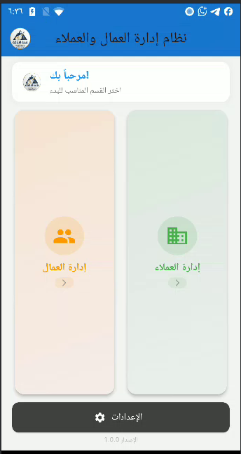
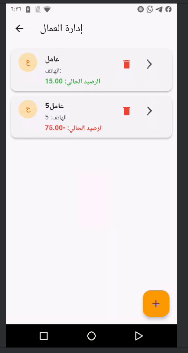
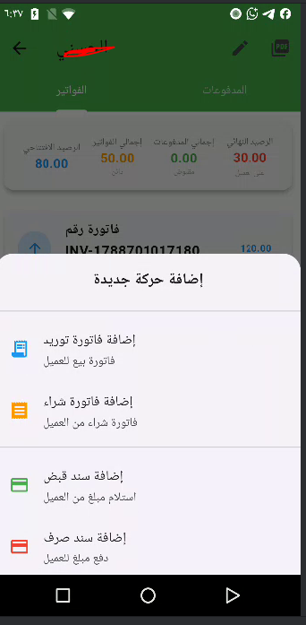

# 📱 معمل قمة الاناقة - نظام إدارة العمال والعملاء


## 📋 نظرة عامة

**معمل قمة الاناقة** هو تطبيق متكامل لإدارة العمال والعملاء، مصمم خصيصاً لتلبية احتياجات المصانع والمعامل. يوفر التطبيق واجهة سهلة الاستخدام لإدارة العمليات اليومية مثل تتبع الإنتاج، المصروفات، الفواتير، وكشوف الحساب.

## ✨ الميزات الرئيسية

### 🧑‍🏭 إدارة العمال
- ➕ إضافة عامل مع رصيد افتتاحي
- 📊 تسجيل حركات الإنتاج
- 💰 تسجيل المصروفات
- 📈 تقارير أسبوعية وشهرية
- 🖨️ طباعة كشوف الحساب

### 👤 إدارة العملاء
- ➕ إضافة عميل مع رصيد افتتاحي
- 📄 فواتير توريد وشراء (متعددة الأصناف)
- 💳 سندات قبض وصرف
- 📊 كشف حساب شامل مع فلترة التاريخ
- 🖨️ طباعة كشوف الحساب

### ⚙️ الإعدادات
- 💱 إدارة العملات (ريال يمني، ريال سعودي)
- 📦 إدارة المنتجات مع أسعار البيع والإنتاج
- 🔄 تغيير العملة الافتراضية

### 🌟 ميزات إضافية
- 💱 دعم تعدد العملات
- 📱 واجهة عربية بالكامل
- 🖨️ طباعة PDF مع دعم اللغة العربية
- 📊 تقارير تفصيلية
- 💾 تخزين محلي باستخدام SQLite

## 📸 صور التطبيق

### شاشة البداية


### الشاشة الرئيسية


### إدارة العمال


### تفاصيل العامل


### إدارة العملاء


### تفاصيل العميل


### كشف حساب العميل


### كشف حساب العامل


### الإعدادات


### إضافة فاتورة


### طباعة PDF


## 🚀 كيفية تشغيل التطبيق

### المتطلبات الأساسية
- Flutter SDK 3.0+
- Android Studio / VS Code
- Android SDK (للتشغيل على Android)
- Xcode (للتشغيل على iOS)

### خطوات التشغيل

1. **نسخ المشروع**
```bash
git clone https://github.com/yourusername/worker_client_management.git
cd worker_client_management
